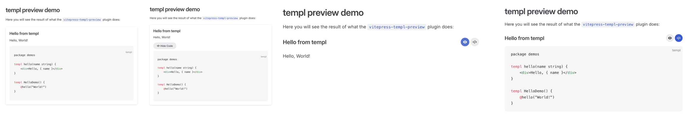
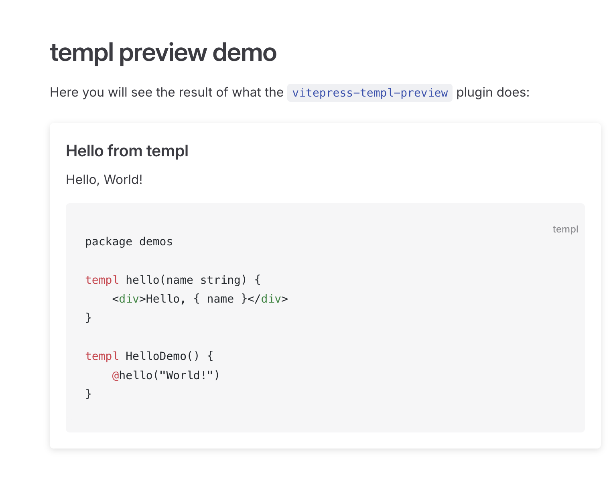
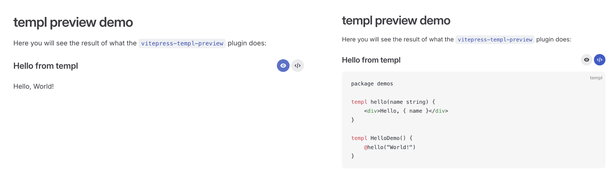

<h1 align="center" style="font-size: 2.5rem;">vitepress-templ-preview</h1>
<h2 align="center">A Vitepress plugin for easily previewing templ components in Markdown.</h2>
<p align="center">
    <a href="https://www.npmjs.com/package/vitepress-templ-preview" target="_blank"></a>
    <a href="https://github.com/indaco/vitepress-templ-preview/blob/main/LICENSE" target="_blank">
        
    </a>
</p>


<hr />

<p align="center">
  <a href="#features">Features</a> •
  <a href="#prerequisites">Prerequisites</a> •
  <a href="#installation">Installation</a> •
  <a href="#usage">Usage</a> •
  <a href="#example">Example</a> •
  <a href="#api">API</a>
</p>

> [!WARNING]
> Currently under development. There are known issues, and it has not been released yet.

This package offers a solution for [templ](https://templ.guide/) component previews within [VitePress](https://vitepress.dev/) projects. It includes:

- **viteTemplPreviewPlugin**: A Vite plugin designed to handle `<templ-demo ...></templ-demo>` tags in your markdown files. This plugin processes these tags and renders a Vue component to display both the highlighted source code and the rendered preview of the templ component.
- **Vue components**: Three predefined Vue components tailored for component preview purposes.

## Features

- **Templ Syntax Highlighting**: Provides syntax highlighting for `templ` files using [shiki-templ](https://github.com/indaco/shiki-templ).
- **Automatic Generation**: Runs `templ generate` command via `static-templ` at server startup, eliminating the need to run this command manually.
- **Hot Reloading**: Automatically triggers the `templ generate` command and command and refresh the page to display the new content.
- **File Content Caching**: Efficiently caches file contents to improve performance and reduce redundant file reads.
- **Flexible Vue Components**: Includes three predefined Vue components for rendering previews, with the option to use custom components.

## Prerequisites

### Vitepress project

For sure, an existing vitepress project. Check [here](https://vitepress.dev/guide/getting-started) and follow the instruction to get started.

### static-templ

To pre-render the components, [static-templ](https://github.com/nokacper24/static-templ) runs behind the scenes. Please, refer to the [README.md](https://github.com/nokacper24/static-templ/blob/main/README.md) file to know more about it.

```bash
go install github.com/nokacper24/static-templ@latest
```

## Installation

```bash
# npm
npm install -D shiki-templ vitepress-templ-preview
# yarn
yarn add -D shiki-templ vitepress-templ-preview
#pnpm
pnpm add -D shiki-templ vitepress-templ-preview
```

## Usage

Assuming you chose to scaffold the VitePress project in `./docs`, the initial generated file structure should look like this:

```bash
.
├─ docs
│  ├─ .vitepress
│  │  └─ config.js
│  ├─ api-examples.md
│  ├─ markdown-examples.md
│  └─ index.md
└─ package.json
```

### 1. Setup a new templ project

1. Create a `templ-preview` folder within `./docs` containing your templ project.
2. Initialize a new Go project within it as you do for a normal `templ` project, refer to the [official doc](https://templ.guide/quick-start/creating-a-simple-templ-component).

   ```bash
   cd templ-preview
   go mod init templ-preview
   go get github.com/a-h/templ
   ```

3. Create a `demos` folder to store your `templ` files

The resulting project structure could look like this:

```bash
.
├─ docs
│  ├─ .vitepress
│  │  └─ config.js
│  ├─ api-examples.md
│  ├─ markdown-examples.md
│  └─ index.md
│  ├─ templ-preview <--
│  │  └─ demos
│  │     └─ hello-demo.templ
│  │  └─ go.mod
│  │  └─ go.sum
└─ package.json
```

> [!NOTE]
> Please, refer to the [API section](#vitetemplpreviewplugin) to see the available options for the plugin.

### 2. Configure VitePress

First, you need to configure the plugin in your VitePress project. Edit your VitePress config file (`.vitepress/config.js` or `.vitepress/config.mts`):

```typescript
// .vitepress/config.mts
import { defineConfig } from "vitepress";
import { templLang } from "shiki-templ";
import viteTemplPreviewPlugin from "vitepress-templ-preview";

// https://vitepress.dev/reference/site-config
export default defineConfig({
  // ...
  vite: {
    plugins: [viteTemplPreviewPlugin()],

    /* or configuring the options if you are not fine with the default ones
    [
      viteTemplPreviewPlugin({
        rootDir: "demos",
        templDir: "components",
        htmlDir: "output",
      }),
    ],
    */
  },
  markdown: {
    languages: [templLang],
  },
  // ...
});
```

### 3. Register the Vue component

You can choose from 3 predefined Vue components or [Use a custom component](#custom-component) for snippets rendering:

<details>
  <summary><i>VTPCard</i></summary>
  
</details>

<details>
  <summary><i>VTPCollapsible</i></summary>
  
</details>

<details>
  <summary><i>VTPTabs</i></summary>
  
</details>

Ensure to register the component in your app. Create or edit `.vitepress/theme/index.js` or `.vitepress/theme/index.ts`:

```typescript
// .vitepress/theme/index.ts
import DefaultTheme from "vitepress/theme";
import { VTPTabs } from "vitepress-templ-preview/ui";
import "vitepress-templ-preview/ui/style.css";

export default {
  ...DefaultTheme,
  enhanceApp({ app }) {
    app.component("templ-preview-component", VTPTabs);
  },
};
```

### 4. Use the code block in the markdown

Next, use the `templ-preview` tag in your markdown files:

```html
<templ-demo src="hello-demo" title="Simple Templ Component"></templ-demo>
<!-- or self-closing tag work too:

<templ-demo src="hello-demo" title="Simple Templ Component"/>

You can set options to it (data-* props are optionals):

<templ-demo
    src="hello-demo"
    title="Simple Templ Component"
    data-button-variant="brand"
    data-theme-light="vitesse-light"
    data-theme-dark="vitesse-dark"
/>

-->
```

## Example

> [!TIP]
> There is a [demo project](./demo/) to be used as reference.

Clone the repos and install all the dependencies:

```bash
git clone https://github.com/indaco/vitepress-templ-preview.git

cd vitepress-templ-preview

pnpm install
```

Run the demo:

```bash
pnpm demo
```

## API

### viteTemplPreviewPlugin

**Options**:

| Option       | Type      | Default         | Description                                                                               |
| :----------- | :-------- | :-------------- | ----------------------------------------------------------------------------------------- |
| `projectDir` | _string_  | `templ-preview` | The base directory where your `templ` project is located.                                 |
| `inputDir`   | _string_  | `demos`         | The directory relative to the `projectDir` where your ".templ" files are located.         |
| `outputDir`  | _string_  | `output`        | The directory relative to the `projectDir` where the generated HTML files will be placed. |
| `debug`      | _boolean_ | `false`         | Whether or not to keep the `static-templ` generation script after completion.             |

### Vue components

A Vue component for rendering tabbed code previews.

**Props**:

| Prop          | Type            | Required | Default                                           | Description                                      |
| :------------ | :-------------- | :------- | ------------------------------------------------- | ------------------------------------------------ |
| `title`       | _string_        | No       |                                                   |                                                  |
| `codeContent` | _string_        | Yes      |                                                   | The code content to display in the code tab.     |
| `htmlContent` | _string_        | Yes      |                                                   | The HTML content to display in the preview tab.  |
| `themes`      | _ThemeOptions_  | No       | `light: 'github-light'`<br/>`dark: 'github-dark'` | Shiki themes for syntax highlighting.            |
| `buttonStyle` | _"alt"/"brand"_ | No       | `alt`                                             | Show/hide code button style in `VTPCollpasible`. |

**Slots**:

| Slot           | Default       | Description                      |
| :------------- | :------------ | -------------------------------- |
| `preview-icon` | `PreviewIcon` | Custom icon for the preview tab. |
| `code-icon`    | `CodeIcon`    | Custom icon for the code tab.    |

### Custom component

You can provide your own Vue components if you wish to customize its look or behaviour.

```html
<!-- MyCustomComponent.vue-->
<script setup lang="ts">
  import type { VTPComponentProps } from "vitepress-templ-preview/types";

  const props = defineProps<VTPComponentProps>();
  /*
  ...
  */
</script>

<template>
  <div class="container">
    <h3 v-html="props.title"></h3>
    <div class="preview">
      <div class="preview-content" v-html="props.htmlContent"></div>
    </div>

    <div class="code-content">
      <div class="language-templ vp-adaptive-theme">
        <button title="Copy Code" class="copy"></button>
        <span class="lang">templ</span>
        <span class="vp-code" v-html="highlightedCode"></span>
      </div>
    </div>
  </div>
</template>

<style scoped>
  /* .... */
</style>
```

register your custom component:

```typescript
// .vitepress/theme/index.ts
import DefaultTheme from "vitepress/theme";
import MyCustomComponent from "MyCustomComponent.vue";

export default {
  ...DefaultTheme,
  enhanceApp({ app }) {
    app.component("templ-preview-component", MyCustomComponent);
  },
};
```

## License

This project is licensed under the MIT License - see the LICENSE file for details.

### Acknowledgements

This project makes use of [static-templ](https://github.com/nokacper24/static-templ), which is licensed under the GNU General Public License (GPL). While the code in this repository is MIT-licensed, please be aware that the dependency on GPL-licensed software may impose additional restrictions. Refer to the [static-templ repository](https://github.com/nokacper24/static-templ) for more information on its licensing terms.
